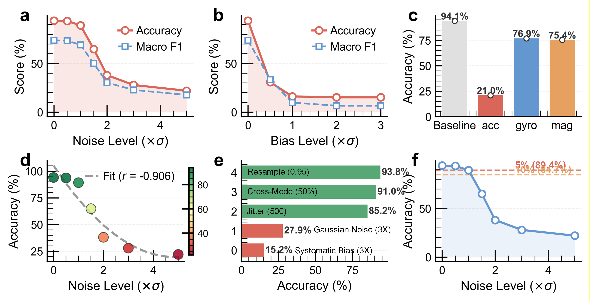
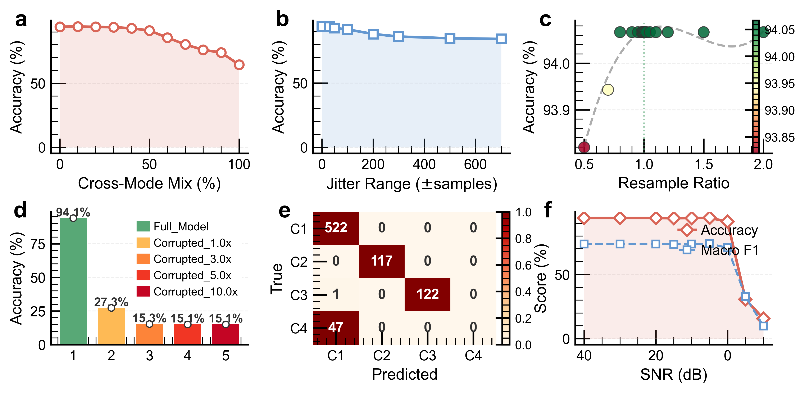

# TC-SGDN: Digital Twin-Assisted UAV Fault Diagnosis

> **T**win-**C**onsistent **S**patio-**T**emporal **G**raph **D**iagnosis **N**etwork — A graph attention network for online fault diagnosis of multirotor UAVs, leveraging digital twin residuals to enhance weak fault observability.

---

## Table of Contents

- [Architecture Overview](#architecture-overview)
- [Repository Structure](#repository-structure)
- [Dataset Description](#dataset-description)
- [Model Architecture](#model-architecture)
- [Training Configuration](#training-configuration)
- [Hardware & Software Platform](#hardware--software-platform)

---

## Architecture Overview

```
┌────────────────────────────────────────────────────────────────────── ┐
│                   Real-Time Fault Diagnosis Pipeline                  │
│                                                                       │
│  ┌──────────┐     ┌───────────┐    ┌──────────────┐     ┌──────────┐  │
│  │ Physical │───▶│  Digital   │───▶│   Feature   │───▶│  TS-SGDN │  │
│  │   UAV    │     │   Twin    │    │ Construction │     │ Diagnoser│  │
│  │  (IMU)   │     │(CopterSim)│    │  (18-ch)     │     │          │  │
│  └──────────┘     └───────────┘    └──────────────┘     └──────────┘  │
│       │               │                │                    │         │
│   raw_data(9ch)   sim_data(9ch)   err = raw - sim       4-class       │
│   [Acc,Gyro,Mag]  [Acc,Gyro,Mag]  → 18ch: raw‖err      diagnosis      │
└──────────────────────────────────────────────────────────────────────┘
```

The pipeline consists of four stages:

1. **Physical UAV** collects 9-channel IMU data (Accelerometer × 3, Gyroscope × 3, Magnetometer × 3) at 50 Hz.
2. **Digital Twin** (CopterSim) runs a synchronized high-fidelity simulation, producing an identical 9-channel output.
3. **Feature Construction** computes the DT residual (`err = raw − sim`) and interleaves it with the raw signal to form an 18-channel representation.
4. **TC-SGDN** constructs a spatio-temporal sensor graph and performs fault classification via graph attention + bidirectional GRU.

### Communication Modes

| Mode | Abbreviation | Description |
|------|-------------|-------------|
| V2V | Vehicle-to-Vehicle | Direct data link between physical UAV and DT |
| R2V | Remote-to-Vehicle | Remote ground station relaying data to DT |

---

## Repository Structure

```
DT-Diagnosis/
├── data/                         # Base flight data (Draw → Dsim → Dpro)
│   ├── Draw/                     #   Raw sensor recordings
│   ├── Dsim/                     #   DT simulation outputs
│   ├── Dpro/                     #   Preprocessed & synchronized data
│   └── Dpro.py                   #   Preprocessing script
│
├── data_for_v2v_c4/              # V2V c4 dataset (training & in-domain test)
│   ├── Draw/ → Dsim/ → Dpro/
│   └── Dpro.py
├── data_for_r2v_c4/              # R2V c4 dataset
│   ├── Draw/ → Dsim/ → Dpro/
│   └── Dpro.py
├── data_for_v2v_m6/              # V2V m6 dataset (cross-domain generalization)
│   ├── Draw/ → Dsim/ → Dpro/
│   └── Dpro.py
├── data_ver/                     # R2V m6 dataset (cross-domain generalization)
│   ├── Draw/ → Dsim/ → Dpro/
│   └── Dpro.py
│
├── model/                        # Training notebooks for all classifiers
│   ├── Classifier_MGAT_GRU.ipynb #   TS-SGDN (proposed method)
│   ├── Classifier_OGAT_GRU.ipynb #   Ablation: standard GAT + GRU
│   ├── Classifier_OGCN_GRU.ipynb #   Ablation: GCN + GRU
│   ├── Classifier_CNN_LSTM.ipynb  #   Baseline: CNN-LSTM
│   ├── Classifier_OGAT_LSTM.ipynb #   Ablation: GAT + LSTM
│   ├── Classifier_OGCN_GRU_S3.ipynb # Ablation: 3-sensor GCN + GRU
│   ├── Classifier_FFSAN.ipynb     #   Baseline [1]: FFSAN
│   ├── Classifier_SAE_CNN.ipynb   #   Baseline [2]: SAE-CNN
│   ├── Classifier_CNN_Transformer.ipynb # Baseline [3]: CNN-Transformer
│   └── Classifier_WaveletCNN.ipynb#   Baseline [4]: WaveletCNN
│
├── ver/                          # Online verification & deployment
│   ├── src/r2v/
│   │   ├── ver_v2v_online.py     #   Online V2V/R2V diagnosis script
│   │   ├── db_FD.json            #   Fault diagnosis config
│   │   ├── utilits/              #   Model definitions for deployment
│   │   ├── QuadModelSITL.bat     #   SITL simulation launcher
│   │   └── SITLRun.bat           #   SITL execution script
│   └── include/                  #   Shared utilities
│
└── README.md                     # This file
```

### Data Pipeline (`Draw` → `Dsim` → `Dpro`)

Each dataset directory follows the same 3-stage pipeline:

| Stage | Directory | Description |
|-------|-----------|-------------|
| **Draw** | `Draw/` | Raw flight recordings from physical UAV (or HIL simulation) |
| **Dsim** | `Dsim/` | Corresponding digital twin simulation outputs |
| **Dpro** | `Dpro/` | Synchronized, time-aligned, preprocessed CSV files |
| **Script** | `Dpro.py` | Automated preprocessing: synchronization + error computation |

---

## Dataset Description

> 📂 Detailed dataset documentation including channel layout, preprocessing pipeline, and graph construction is available in [`data_for_v2v_c4/README.md`](data_for_v2v_c4/README.md).

### Sensor Configuration

9-channel synchronized IMU data at **50 Hz** sampling rate:

| Channel Group | Channels | Unit |
|:---:|:---:|:---:|
| Accelerometer | Acc-x, Acc-y, Acc-z | m/s² |
| Gyroscope | Gyro-x, Gyro-y, Gyro-z | rad/s |
| Magnetometer | Mag-x, Mag-y, Mag-z | Gauss |

### 4-Class Fault Taxonomy

| Class | Label | Fault Type | Physical Mechanism | Injection |
|:-----:|:-----:|-----------|-------------------|-----------|
| C1 | 1 | Normal | No fault | — |
| C2 | 2 | Accelerometer anomaly | Additive sensor bias on Acc-X | flag3=3000 |
| C3 | 3 | Motor disturbance | Motor vibration (multi-channel) | flag3=200, motor03 |
| C4 | 4 | Efficiency degradation | Multiplicative thrust reduction | flag4=0.85, motor03 |

### Dataset Variants

| Dataset | Path | Comm. Mode | Purpose |
|---------|------|:----------:|---------|
| **c4** | `data_for_v2v_c4/` | V2V | Training & in-domain test |
| **c4** | `data_for_r2v_c4/` | R2V | Training & in-domain test |
| **m6** | `data_for_v2v_m6/` | V2V | Cross-domain generalization (aggressive maneuvers) |
| **m6** | `data_ver/` | R2V | Cross-domain generalization (aggressive maneuvers) |

---

## Model Architecture

### TS-SGDN (Proposed Method)
```
Input: (T=80, 18) time-series
    │
    ▼
┌─────────────────────────────────────────┐
│      Spatio-Temporal Graph Construction │
│  • 6 sensor nodes per timestep          │
│  • 3 features per node (x, y, z)        │
│  • 480 nodes total (6 × 80)             │
│  • 6 edge types (temporal/spatial/R↔E)  │
└──────────────┬──────────────────────────┘
               ▼
┌───────────────────────────────────────────┐
│        Edge-Type-Aware GAT (MyGATConv)    │
│  • in_channels = 3                        │
│  • out_channels = 32                      │
│  • heads = 4 (multi-head, concat=True)    │
│  • Edge-type attention weighting:         │
│    w_temporal(0) = 0.1                    │
│    w_spatial(1-4) = 0.2                   │
│    w_raw↔err(5)  = 0.7                    │
│  • Additive bias: α = α·w + 1.0           │
│  • LeakyReLU(0.2), Dropout(0.3)           │
│  → Output: (480, 128)                     │
└──────────────┬────────────────────────────┘
               ▼
┌───────────────────────────────────────────┐
│           Swish Activation                │
│  x = σ(x) × x                             │
│  → Gate-modulated feature refinement      │
└──────────────┬────────────────────────────┘
               ▼
┌───────────────────────────────────────────┐
│     Reshape to Temporal Sequence          │
│  (480, 128) → (80, 6×128) = (80, 768)     │
└──────────────┬────────────────────────────┘
               ▼
┌───────────────────────────────────────────┐
│        Bidirectional GRU                  │
│  • input_dim = 768                        │
│  • hidden_dim = 64                        │
│  • bidirectional = True                   │
│  • layers = 1                             │
│  → Output: (80, 128)                      │
└──────────────┬────────────────────────────┘
               ▼
┌───────────────────────────────────────────┐
│       Temporal Mean Pooling               │
│  (80, 128) → (128,)                       │
└──────────────┬────────────────────────────┘
               ▼
┌───────────────────────────────────────────┐
│        Fully Connected Classifier         │
│  Linear(128 → 4) → logits                 │
└───────────────────────────────────────────┘
```

### Sensor Graph Topology

```
Timestep t                    Timestep t+1
┌─────────────────┐          ┌─────────────────┐
│ Acc   ←──5──→ EAcc  │──0──▶│ Acc   ←──5──→ EAcc  │
│  ↑↕1,3          │          │  ↑↕              │
│ Gyro  ←──5──→ EGyro │──0──▶│ Gyro  ←──5──→ EGyro │
│  ↑↕2,4          │          │  ↑↕              │
│ Mag   ←──5──→ EMag  │──0──▶│ Mag   ←──5──→ EMag  │
└─────────────────┘          └─────────────────┘
  Numbers = edge type IDs
```

## Training Configuration

| Parameter | Value |
|-----------|-------|
| Optimizer | Adam |
| Learning rate | 0.001 |
| Epochs | 15 |
| Batch size | 64 |
| Loss function | CrossEntropyLoss |
| Train / Test split | 70% / 30% |
| Shuffle | True |
| Random seed | 42 (`torch.manual_seed`, `np.random.seed`, `random_state`) |
| Device | CUDA (GPU) |

---

## Hardware & Software Platform

### Hardware

| Component | Specification |
|-----------|--------------|
| UAV Platform | FEISI X150 ([feisilab.com](http://www.feisilab.com/?product_31/62.html)) |
| Onboard Compute | Rockchip RK3588 (8-core ARM, 6 TOPS NPU) |
| Ground Station GPU | NVIDIA GeForce RTX 3060 Laptop (6 GB GDDR6) |
| Indoor Positioning | Motion Capture System |
| State Estimation | 6-axis IMU (Accelerometer + Gyroscope) |

### Software

| Component | Link |
|-----------|------|
| DT Simulator | CopterSim ([GitHub](https://github.com/RflySim/CopterSim)) |
| 3D Renderer | RflySim3D ([GitHub](https://github.com/RflySim/Docs)) |
| Ground Control | QGroundControl ([qgroundcontrol.com](https://qgroundcontrol.com/)) |
| DL Framework | PyTorch + torch\_geometric |
| Python | 3.8+ |

### Dependencies

```
torch >= 1.10
torch_geometric
numpy
pandas
scikit-learn
scipy
matplotlib
openpyxl
```

---

---

## Robustness Analysis to DT Uncertainty

To evaluate the operational boundaries of the TC-SGDN framework, we systematically investigated its robustness against two primary sources of digital twin uncertainties: **parameter perturbations** and **synchronization errors**.

### Robustness to DT Parameter Perturbations



**Figure 3. Robustness of the diagnosis model under DT feature perturbation.** Tested on a 4-class UAV fault diagnosis task (normal, X-axis Acc fault, motor efficiency fault, motor PWM limiting fault); perturbations are applied only to DT error feature channels, with reference noise standard deviation $\sigma=0.558$. (a)(b) Line plots of model performance under Gaussian noise ($0\sim5\sigma$) and systematic bias ($0\sim3\sigma$), respectively. (c) Bar chart of model accuracy under selective $3\sigma$ noise perturbation on Acc, Gyro, and Mag channels. (d) Scatter with quadratic fitting curve showing the correlation between noise level and accuracy. (e) Horizontal bar chart of model perturbation sensitivity. (f) Line plot of accuracy with increasing noise level.

#### Key Findings

*   **Random Noise Tolerance (Unmodeled Non-linearities):** The model exhibits strong robustness against random modeling uncertainties. Accuracy remains highly stable (>89%) even when random noise reaches $1\sigma$. Random errors fail to break the spatiotemporal invariants structure learned by the model, demonstrating that the graph network effectively absorbs non-systematic residuals.
*   **Systematic Bias Sensitivity:** The system is highly sensitive to systematic offsets. A mere $0.5\sigma$ bias causes accuracy to plummet to ~30%. This reveals that **"structural offsets"** (not complex unmodeled non-linearities) are the dominant risk factor. These offsets shift the healthy baseline and invalidate the physical meaning of the residual direction.
*   **Channel Dependencies:** Perturbations in accelerometer channels cause significantly steeper performance degradation (~21% accuracy) compared to gyroscope/magnetometer channels (~17-18%), indicating highly structure-dependent fault feature coupling.

### Robustness to Synchronization Errors & Data Quality



**Figure 4. Model robustness under DT time synchronization error and data corruption.** Time synchronization error is simulated by modifying DT feature time alignment; DT data corruption is implemented by replacing DT channels with Gaussian noise. (a) Line plot of model accuracy under cross-mode DT data mixing. (b) Line plot under random time jitter ($\pm0$ to $\pm700$ sample offset). (c) Impact of resampling ratio ($0.5\sim2.0$) deviation on model accuracy. (d) Bar chart under DT data corruption ($1.0\times$ to $10.0\times$ noise level). (e) Confusion matrix of the full model on the test set. (f) Line plots of model Accuracy and F1 score under decreasing SNR ($40$ dB to $-10$ dB).

#### Key Findings

*   **Temporal Desynchronization Robustness:** The model handles severe synchronization errors remarkably well. It maintains >91% accuracy under $\pm100$ sample jitter or $\le50\%$ cross-modal mixing, and ~94% accuracy across $0.5\times$ to $2.0\times$ sampling rate deviations. This success stems from the fact that the graph structure relies primarily on **relational patterns** rather than strict temporal point-to-point numerical alignment.
*   **SNR and Data Corruption Boundaries:** A critical Signal-to-Noise Ratio (SNR) threshold exists at ~5 dB. When SNR drops below 0 dB or corruption exceeds the $1\sigma$ level, the diagnostic class structure completely collapses (accuracy approaching random guessing at ~15%).
*   **Role of the Digital Twin:** Once DT information is severely invalidated, the class structure collapses. This proves that the DT is not merely "supplementary information," but a critical reference for establishing decision boundaries. Our boundary tests conclusively demonstrate that the framework **does not require absolute high-fidelity non-linear modeling**, but relies strictly on **dynamic consistency and the absence of systematic offsets**.
